# 🤖 COMPREHENSIVE DEVELOPER HANDOFF

**Project**: MyNotes Flutter Application  
**Date**: January 30, 2026  
**Status**: Phase 5 Complete (83%) - Phase 6 Pending  
**Quality**: Production-ready codebase with integration work remaining

---

## 📋 EXECUTIVE SUMMARY

MyNotes is a professional-grade Flutter productivity application with:
- **77+ Screens** across 6 feature modules
- **45+ Features** (notes, todos, reminders, media, AI, analytics)
- **35+ Services** with clean architecture
- **16 SQLite Tables** for data persistence
- **Clean 4-Layer Architecture** (Presentation → Domain → Data → Core)

---

## 🏗️ ARCHITECTURE OVERVIEW

```
┌─────────────────────────────────────────────────────────────────────┐
│                     📱 PRESENTATION LAYER                           │
│  lib/presentation/                                                  │
│  ├── pages/         → 77 Screen widgets                            │
│  ├── screens/       → 9 Additional screen widgets                  │
│  ├── widgets/       → 65+ Reusable components                      │
│  └── bloc/          → 45+ State management (BLoC pattern)          │
├─────────────────────────────────────────────────────────────────────┤
│                     🎯 DOMAIN LAYER                                 │
│  lib/domain/                                                        │
│  ├── entities/      → 19 Business objects                          │
│  └── repositories/  → Abstract interfaces                          │
├─────────────────────────────────────────────────────────────────────┤
│                     💾 DATA LAYER                                   │
│  lib/data/                                                          │
│  ├── repositories/  → 10 Repository implementations                │
│  ├── models/        → Data transfer objects                        │
│  └── datasources/   → Database access layer                        │
├─────────────────────────────────────────────────────────────────────┤
│                     ⚙️ CORE LAYER                                   │
│  lib/core/                                                          │
│  ├── services/      → 35+ Business logic services                  │
│  ├── database/      → SQLite configuration                         │
│  ├── routes/        → Navigation (app_router.dart, app_routes.dart)│
│  ├── themes/        → UI theme system                              │
│  └── notifications/ → Alert & notification system                  │
└─────────────────────────────────────────────────────────────────────┘
```

---

## 🗺️ COMPLETE NAVIGATION FLOW

### 📌 App Entry Flow

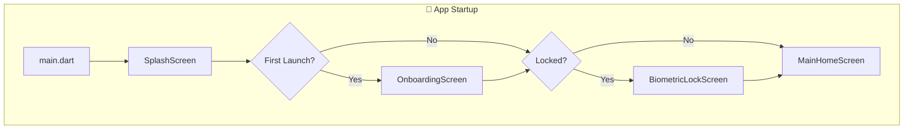

### 📌 Main Navigation Hub (Bottom Navigation)

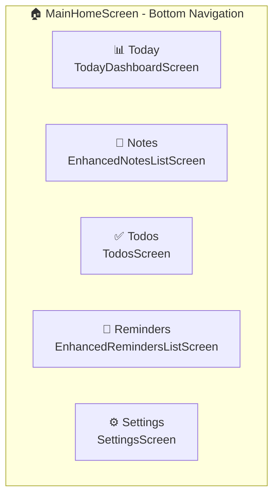

---

## 📱 COMPLETE SCREEN INVENTORY WITH NAVIGATION

### 🏠 **Module 1: Main Navigation**

| Screen | File Path | Route | Parent | Entry Point |
|--------|-----------|-------|--------|-------------|
| Splash | `splash_screen.dart` | `/` | — | App Start |
| Onboarding | `onboarding_screen.dart` | `/onboarding` | Splash | First Launch |
| Main Home | `main_home_screen.dart` | `/home` | Splash | Always |
| Today Dashboard | `today_dashboard_screen.dart` | `/today` | MainHome | Tab 1 |
| Main Navigation | `main_navigation_screen.dart` | — | — | Alternative nav |

### 📝 **Module 2: Notes Management**

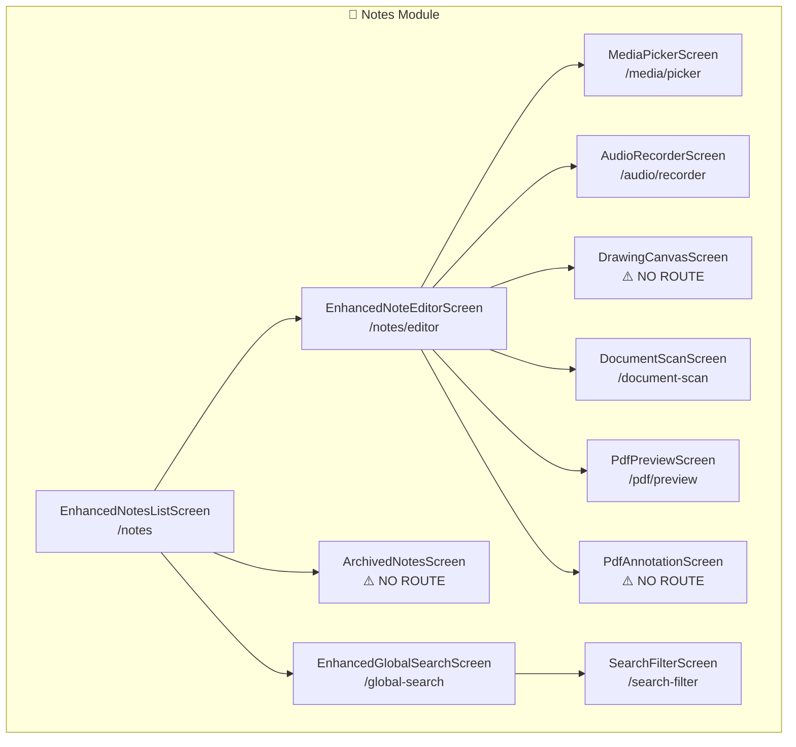

| Screen | File Path | Route | Status |
|--------|-----------|-------|--------|
| Notes List | `enhanced_notes_list_screen.dart` | `/notes` | ✅ Connected |
| Note Editor | `enhanced_note_editor_screen.dart` | `/notes/editor` | ✅ Connected |
| Advanced Editor | `advanced_note_editor.dart` | `/notes/advanced-editor` | ⚠️ Commented out |
| Archived Notes | `archived_notes_screen.dart` | — | ❌ **MISSING ROUTE** |
| Global Search | `enhanced_global_search_screen.dart` | `/global-search` | ✅ Connected |
| Search Filter | `search_filter_screen.dart` | `/search-filter` | ✅ Connected |
| Daily Highlight | `daily_highlight_summary_screen.dart` | `/daily-highlight-summary` | ✅ Connected |
| Edit Highlight | `edit_daily_highlight_screen_new.dart` | `/edit-daily-highlight` | ✅ Connected |

### ✅ **Module 3: Todos Management**

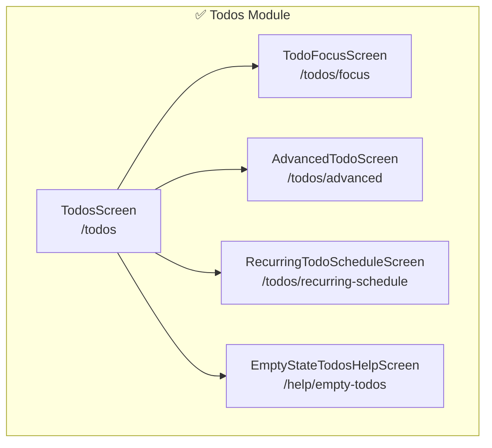

| Screen | File Path | Route | Status |
|--------|-----------|-------|--------|
| Todos List | `todos_screen_fixed.dart` | `/todos` | ✅ Connected |
| Simple Todos | `todos_screen_simple.dart` | — | Alternative |
| Todo Focus | `todo_focus_screen.dart` | `/todos/focus` | ✅ Connected |
| Advanced Todo | `advanced_todo_screen.dart` | `/todos/advanced` | ✅ Connected |
| Recurring Schedule | `recurring_todo_schedule_screen.dart` | `/todos/recurring-schedule` | ✅ Connected |
| Empty State Help | `empty_state_todos_help_screen.dart` | `/help/empty-todos` | ✅ Connected |

### 🔔 **Module 4: Reminders & Alerts**

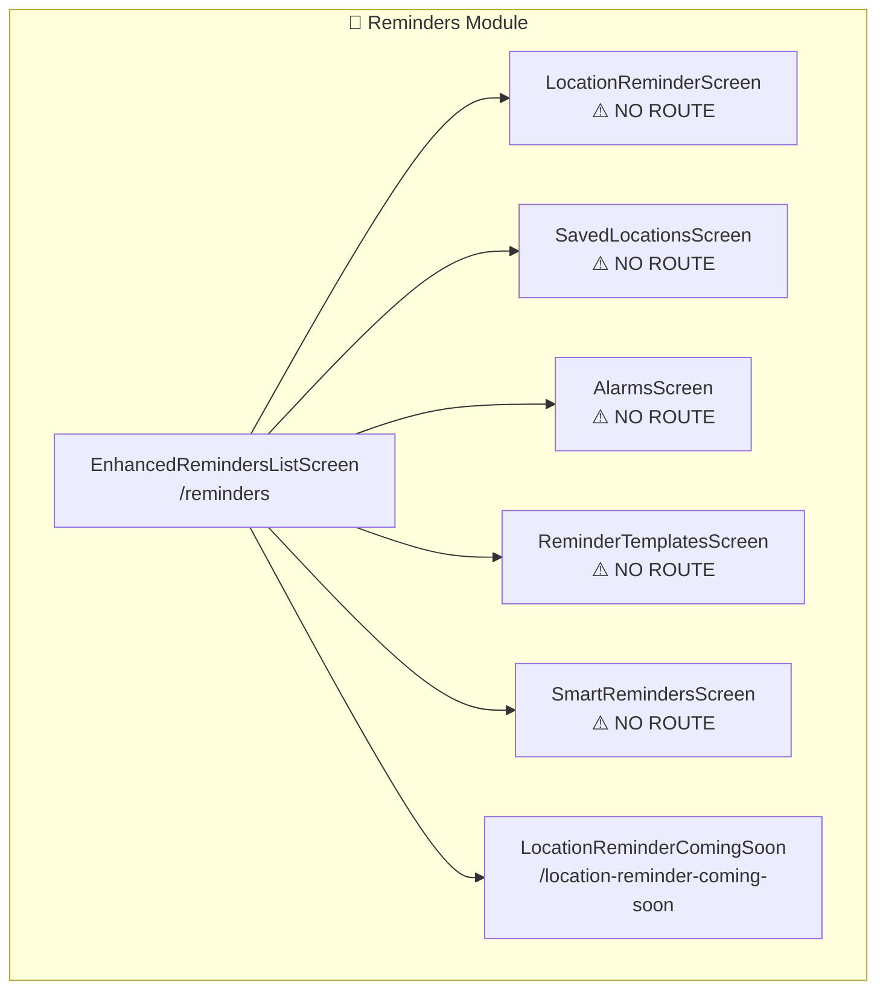

| Screen | File Path | Route | Status |
|--------|-----------|-------|--------|
| Reminders List | `enhanced_reminders_list_screen.dart` | `/reminders` | ✅ Connected |
| Location Reminder | `location_reminder_screen.dart` | — | ❌ **MISSING ROUTE** |
| Location Coming Soon | `location_reminder_coming_soon_screen.dart` | `/location-reminder-coming-soon` | ✅ Connected |
| Saved Locations | `saved_locations_screen.dart` | — | ❌ **MISSING ROUTE** |
| Alarms | `alarms_screen.dart` | — | ❌ **MISSING ROUTE** |
| Smart Reminders | `smart_reminders_screen.dart` | — | ❌ **MISSING ROUTE** |
| Reminder Templates | `reminder_templates_screen.dart` | — | ❌ **MISSING ROUTE** |
| Calendar Integration | `calendar_integration_screen.dart` | `/calendar-integration` | ✅ Connected |

### 🖼️ **Module 5: Media Management**

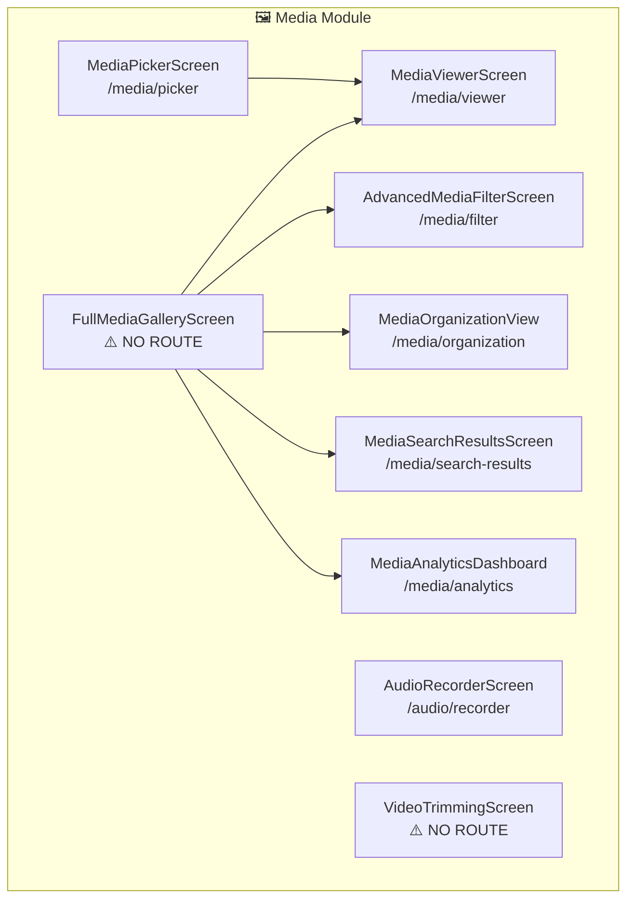

| Screen | File Path | Route | Status |
|--------|-----------|-------|--------|
| Media Gallery | `full_media_gallery_screen.dart` | — | ❌ **MISSING ROUTE** |
| Media Viewer | `media_viewer_screen.dart` | `/media/viewer` | ✅ Connected |
| Media Picker | `media_picker_screen.dart` | `/media/picker` | ✅ Connected |
| Media Filter | `media_filter_screen.dart` | `/media/filter` | ✅ Connected |
| Media Filters | `media_filters_screen.dart` | — | ❌ **MISSING ROUTE** |
| Media Organization | `batch_4_media_organization_view.dart` | `/media/organization` | ✅ Connected |
| Media Search Results | `batch_4_media_search_results.dart` | `/media/search-results` | ✅ Connected |
| Media Analytics | `media_analytics_dashboard.dart` | `/media/analytics` | ✅ Connected |
| Audio Recorder | `audio_recorder_screen.dart` | `/audio/recorder` | ✅ Connected |
| Video Trimming | `video_trimming_screen.dart` | — | ❌ **MISSING ROUTE** |

### 🎯 **Module 6: Focus & Productivity**

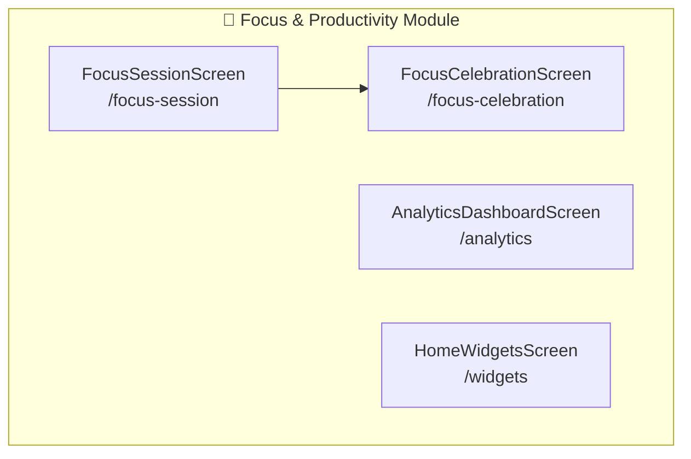

| Screen | File Path | Route | Status |
|--------|-----------|-------|--------|
| Focus Session | `focus_session_screen.dart` | `/focus-session` | ✅ Connected |
| Focus Celebration | `focus_celebration_screen.dart` | `/focus-celebration` | ✅ Connected |
| Analytics Dashboard | `analytics_dashboard_screen.dart` | `/analytics` | ✅ Connected |
| Home Widgets | `home_widgets_screen.dart` | `/widgets` | ✅ Connected |

### 💭 **Module 7: Reflection Journal**

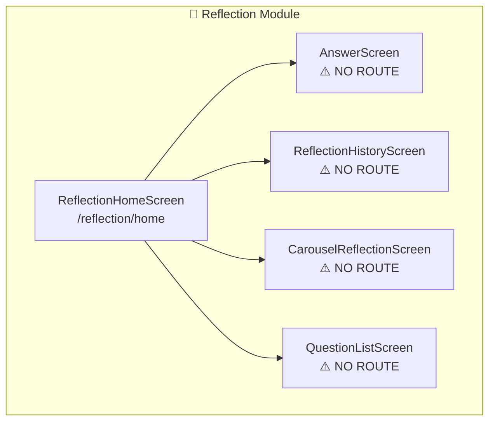

| Screen | File Path | Route | Status |
|--------|-----------|-------|--------|
| Reflection Home | `reflection_home_screen.dart` | `/reflection/home` | ✅ Connected |
| Answer Screen | `answer_screen.dart` | — | ❌ **MISSING ROUTE** |
| Reflection History | `reflection_history_screen.dart` | — | ❌ **MISSING ROUTE** |
| Carousel Reflection | `carousel_reflection_screen.dart` | — | ❌ **MISSING ROUTE** |
| Question List | `question_list_screen.dart` | — | ❌ **MISSING ROUTE** |
| Reflection Screens | `reflection_screens.dart` | — | Barrel file |

### 📂 **Module 8: Smart Collections**

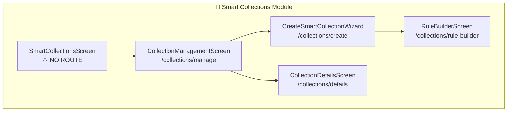

| Screen | File Path | Route | Status |
|--------|-----------|-------|--------|
| Smart Collections | `smart_collections_screen.dart` | — | ❌ **MISSING ROUTE** |
| Collection Management | `batch_5_collection_management_screen.dart` | `/collections/manage` | ✅ Connected |
| Create Collection Wizard | `batch_5_create_collection_wizard.dart` | `/collections/create` | ✅ Connected |
| Rule Builder | `batch_5_rule_builder_screen.dart` | `/collections/rule-builder` | ✅ Connected |
| Collection Details | `batch_5_collection_details_screen.dart` | `/collections/details` | ✅ Connected |

### 🤖 **Module 9: Smart Reminders (AI)**

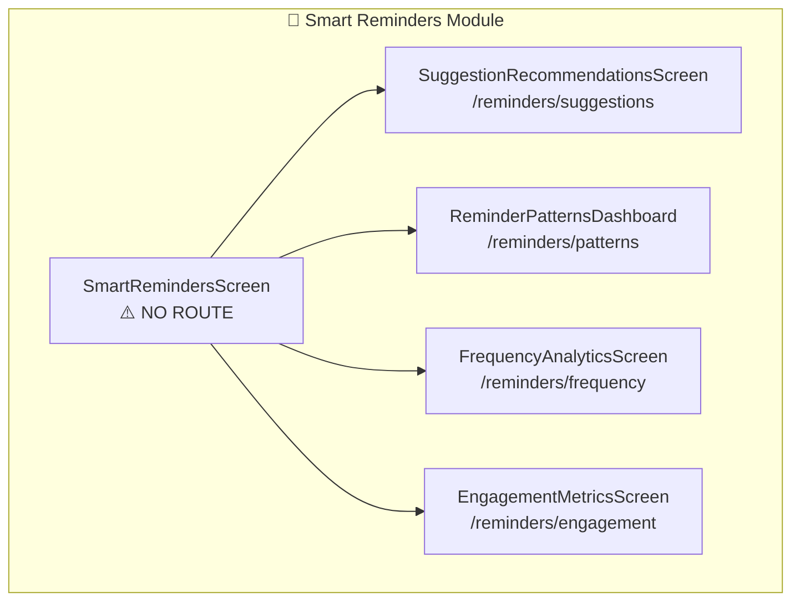

| Screen | File Path | Route | Status |
|--------|-----------|-------|--------|
| Suggestion Recommendations | `batch_6_suggestion_recommendations_screen.dart` | `/reminders/suggestions` | ✅ Connected |
| Reminder Patterns | `batch_6_reminder_patterns_dashboard.dart` | `/reminders/patterns` | ✅ Connected |
| Frequency Analytics | `batch_6_frequency_analytics_screen.dart` | `/reminders/frequency` | ✅ Connected |
| Engagement Metrics | `batch_6_engagement_metrics_screen.dart` | `/reminders/engagement` | ✅ Connected |

### 📄 **Module 10: Templates**

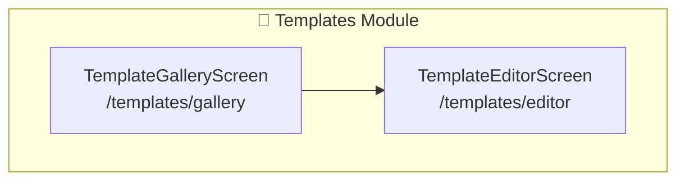

| Screen | File Path | Route | Status |
|--------|-----------|-------|--------|
| Template Gallery | `batch_7_template_gallery_screen.dart` | `/templates/gallery` | ✅ Connected |
| Template Editor | `batch_7_template_editor_screen.dart` | `/templates/editor` | ✅ Connected |

### 🔍 **Module 11: Advanced Search**

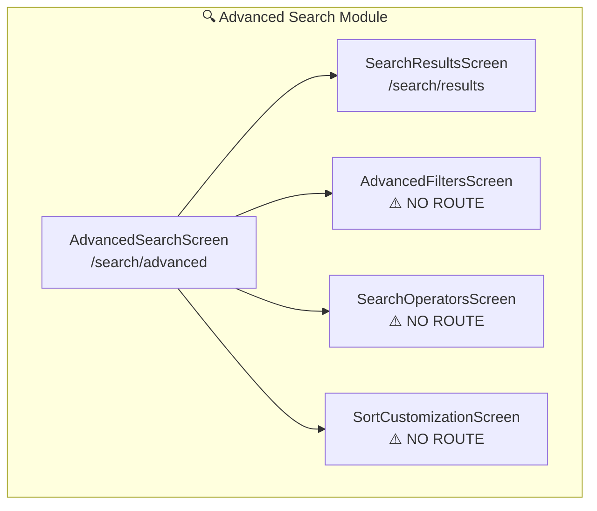

| Screen | File Path | Route | Status |
|--------|-----------|-------|--------|
| Advanced Search | `batch_8_advanced_search_screen.dart` | `/search/advanced` | ✅ Connected |
| Search Results | `batch_8_search_results_screen.dart` | `/search/results` | ✅ Connected |
| Advanced Filters | `advanced_filters_screen.dart` | — | ❌ **MISSING ROUTE** |
| Search Operators | `search_operators_screen.dart` | — | ❌ **MISSING ROUTE** |
| Sort Customization | `sort_customization_screen.dart` | — | ❌ **MISSING ROUTE** |

### ⚙️ **Module 12: Settings**

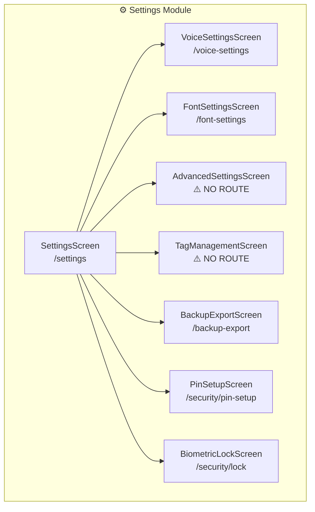

| Screen | File Path | Route | Status |
|--------|-----------|-------|--------|
| Settings | `settings_screen.dart` | `/settings` | ✅ Connected |
| Advanced Settings | `advanced_settings_screen.dart` | — | ❌ **MISSING ROUTE** |
| Voice Settings | `voice_settings_screen.dart` | `/voice-settings` | ✅ Connected |
| Font Settings | `font_settings_screen.dart` | `/font-settings` | ✅ Connected |
| Tag Management | `tag_management_screen.dart` | — | ❌ **MISSING ROUTE** |
| Backup Export | `backup_export_screen.dart` | `/backup-export` | ✅ Connected |
| Pin Setup | `pin_setup_screen.dart` | `/security/pin-setup` | ✅ Connected |
| Biometric Lock | `biometric_lock_screen.dart` | `/security/lock` | ✅ Connected |

### 📷 **Module 13: Document & Scanning**

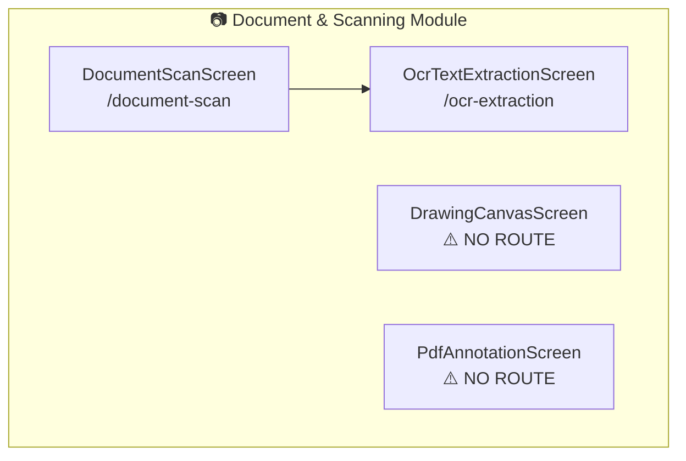

| Screen | File Path | Route | Status |
|--------|-----------|-------|--------|
| Document Scan | `document_scan_screen.dart` | `/document-scan` | ✅ Connected |
| OCR Extraction | `ocr_text_extraction_screen.dart` | `/ocr-extraction` | ✅ Connected |
| Drawing Canvas | `drawing_canvas_screen.dart` | — | ❌ **MISSING ROUTE** |
| PDF Annotation | `pdf_annotation_screen.dart` | — | ❌ **MISSING ROUTE** |
| PDF Preview | `pdf_preview_screen.dart` | `/pdf/preview` | ✅ Connected |

### ➕ **Module 14: Quick Actions**

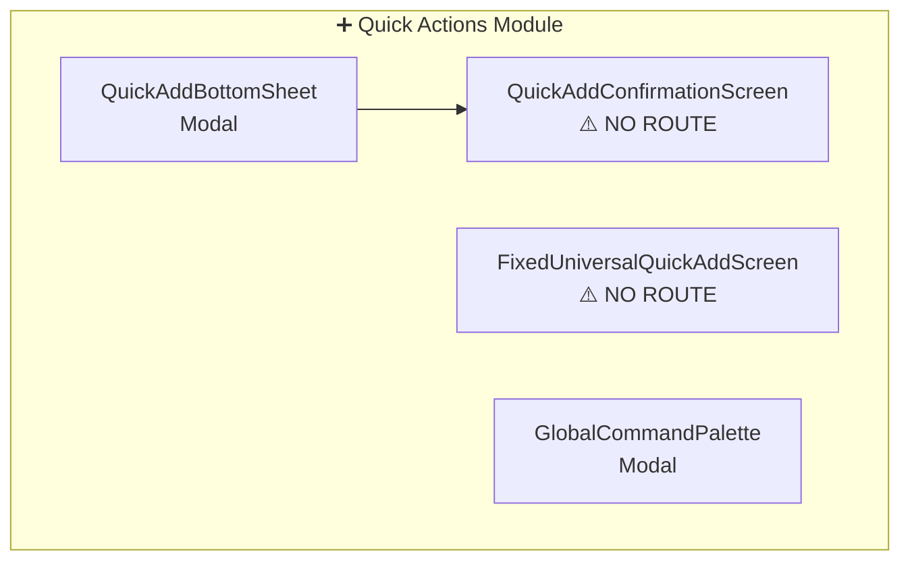

| Screen | File Path | Route | Status |
|--------|-----------|-------|--------|
| Quick Add | `quick_add_bottom_sheet.dart` | `/quick-add` (Modal) | ✅ Connected |
| Quick Add Confirmation | `quick_add_confirmation_screen.dart` | — | ❌ **MISSING ROUTE** |
| Universal Quick Add | `fixed_universal_quick_add_screen.dart` | — | ❌ **MISSING ROUTE** |
| Command Palette | `global_command_palette.dart` | `/command-palette` | ✅ Connected |

### 🔗 **Module 15: Integrations & Features**

| Screen | File Path | Route | Status |
|--------|-----------|-------|--------|
| Integrated Features | `integrated_features_screen.dart` | `/integrated-features` | ✅ Connected |
| Cross Feature Demo | `cross_feature_demo.dart` | — | ❌ **MISSING ROUTE** |
| Location Picker | `location_picker_screen.dart` | — | ❌ **MISSING ROUTE** |
| Unified Items | `unified_items_screen.dart` | — | ❌ **MISSING ROUTE** |

---

## ⚠️ CRITICAL ISSUES TO FIX

### **Missing Routes Summary (22 screens need routes)**

| Priority | Screen | Suggested Route |
|----------|--------|-----------------|
| 🔴 HIGH | `archived_notes_screen.dart` | `/notes/archived` |
| 🔴 HIGH | `smart_collections_screen.dart` | `/collections` |
| 🔴 HIGH | `smart_reminders_screen.dart` | `/reminders/smart` |
| 🔴 HIGH | `location_reminder_screen.dart` | `/reminders/location` |
| 🔴 HIGH | `full_media_gallery_screen.dart` | `/media/gallery` |
| 🟡 MEDIUM | `alarms_screen.dart` | `/alarms` |
| 🟡 MEDIUM | `saved_locations_screen.dart` | `/locations/saved` |
| 🟡 MEDIUM | `reminder_templates_screen.dart` | `/reminders/templates` |
| 🟡 MEDIUM | `advanced_settings_screen.dart` | `/settings/advanced` |
| 🟡 MEDIUM | `tag_management_screen.dart` | `/tags` |
| 🟡 MEDIUM | `drawing_canvas_screen.dart` | `/drawing` |
| 🟡 MEDIUM | `pdf_annotation_screen.dart` | `/pdf/annotate` |
| 🟡 MEDIUM | `video_trimming_screen.dart` | `/media/trim` |
| 🟡 MEDIUM | `answer_screen.dart` | `/reflection/answer` |
| 🟡 MEDIUM | `reflection_history_screen.dart` | `/reflection/history` |
| 🟡 MEDIUM | `carousel_reflection_screen.dart` | `/reflection/carousel` |
| 🟡 MEDIUM | `question_list_screen.dart` | `/reflection/questions` |
| 🟡 MEDIUM | `advanced_filters_screen.dart` | `/filters/advanced` |
| 🟡 MEDIUM | `search_operators_screen.dart` | `/search/operators` |
| 🟡 MEDIUM | `sort_customization_screen.dart` | `/sort` |
| 🟢 LOW | `quick_add_confirmation_screen.dart` | `/quick-add/confirm` |
| 🟢 LOW | `fixed_universal_quick_add_screen.dart` | `/quick-add/universal` |

---

## 🔧 SERVICES ARCHITECTURE

### **Service Categories**

```
┌─────────────────────────────────────────────────────────────────┐
│                        CORE SERVICES                             │
├─────────────────────────────────────────────────────────────────┤
│                                                                  │
│  🔐 AUTHENTICATION & SECURITY                                   │
│  ├── BiometricAuthService     → Fingerprint/Face auth          │
│  ├── AutoLockService          → Auto-lock on inactivity        │
│  ├── PermissionService        → Runtime permissions            │
│  ├── PermissionHandlerService → Multi-permission handling      │
│  └── LocationPermissionManager → Location permissions          │
│                                                                  │
│  📍 LOCATION SERVICES                                           │
│  ├── LocationService          → GPS & location tracking        │
│  ├── LocationBackgroundService → Background updates            │
│  ├── GeofenceService          → Geofence detection             │
│  ├── LocationNotificationService → Location alerts             │
│  └── LocationRemindersManager → Location reminder logic        │
│                                                                  │
│  🔔 NOTIFICATIONS                                               │
│  ├── NotificationService      → Push notifications             │
│  ├── SmartNotificationsService → Intelligent delivery          │
│  ├── AlarmService             → Alarm management               │
│  └── AlarmSoundService        → Sound playback                 │
│                                                                  │
│  📸 MEDIA & CAPTURE                                             │
│  ├── MediaCaptureService      → Photo/video/audio capture      │
│  ├── OCRService               → Text recognition               │
│  ├── DocumentScannerService   → Document scanning              │
│  ├── SpeechService            → Speech-to-text                 │
│  └── AudioFeedbackService     → Audio feedback                 │
│                                                                  │
│  ⏱️ PRODUCTIVITY                                                │
│  ├── PomodoroService          → Focus session timer            │
│  ├── TodoService              → Todo business logic            │
│  ├── VoiceCommandService      → Voice commands                 │
│  ├── SpeechSettingsService    → Speech settings                │
│  └── LanguageService          → Multi-language support         │
│                                                                  │
│  🤖 AI & SMART FEATURES (Phase 5)                               │
│  ├── AISuggestionEngine       → ML-based suggestions           │
│  ├── AdvancedSearchRankingService → Search ranking             │
│  ├── RuleEvaluationEngine     → Collection rule evaluation     │
│  ├── TemplateConversionService → Template processing           │
│  └── MediaFilteringService    → Advanced media filtering       │
│                                                                  │
│  💾 DATABASE & STORAGE                                          │
│  ├── DatabaseEncryptionService → SQLCipher encryption          │
│  ├── SecureFileStorageService → Encrypted file storage         │
│  ├── CloudSyncService         → Cloud synchronization          │
│  ├── ExportService            → PDF/CSV/JSON export            │
│  ├── PrintingService          → Print functionality            │
│  └── SettingsService          → Settings persistence           │
│                                                                  │
│  🔗 INTEGRATIONS                                                │
│  ├── EmailService             → Email sending                  │
│  ├── ClipboardService         → Clipboard operations           │
│  ├── DeepLinkingService       → Deep link handling             │
│  └── PlacesService            → Google Places API              │
│                                                                  │
│  🎨 CUSTOMIZATION                                               │
│  ├── ThemeCustomizationService → Theme management              │
│  ├── AccessibilityHelper      → Accessibility features         │
│  └── ThemeBLoC                → Theme state management         │
│                                                                  │
└─────────────────────────────────────────────────────────────────┘
```

---

## 🗄️ DATABASE SCHEMA

### **16 SQLite Tables**

```sql
-- CORE DATA
┌─────────────────────────────────────────────────────────────────┐
│ notes                        │ todos                            │
│ ├── id (PK)                  │ ├── id (PK)                     │
│ ├── title                    │ ├── title                       │
│ ├── content                  │ ├── description                 │
│ ├── tags                     │ ├── isCompleted                 │
│ ├── color                    │ ├── dueDate                     │
│ ├── isPinned                 │ ├── priority                    │
│ ├── isArchived               │ ├── isRecurring                 │
│ ├── createdAt                │ ├── recurrencePattern           │
│ ├── updatedAt                │ ├── subtasks                    │
│ ├── linkedNotes              │ ├── linkedNotes                 │
│ ├── mediaIds                 │ ├── estimatedTime               │
│ └── templateId               │ └── completedAt                 │
├─────────────────────────────────────────────────────────────────┤
│ media_items                  │ reminders                        │
│ ├── id (PK)                  │ ├── id (PK)                     │
│ ├── filePath                 │ ├── noteId (FK)                 │
│ ├── type                     │ ├── todoId (FK)                 │
│ ├── duration                 │ ├── reminderTime                │
│ ├── size                     │ ├── isRecurring                 │
│ ├── createdAt                │ ├── repeatPattern               │
│ ├── metadata                 │ └── isEnabled                   │
│ ├── thumbnailPath            │                                  │
│ └── tags                     │                                  │
└─────────────────────────────────────────────────────────────────┘

-- RELATIONSHIPS
┌─────────────────────────────────────────────────────────────────┐
│ collection_notes             │ note_links                       │
│ ├── collectionId (FK)        │ ├── sourceNoteId (FK)           │
│ └── noteId (FK)              │ └── targetNoteId (FK)           │
├─────────────────────────────────────────────────────────────────┤
│ subtasks                                                        │
│ ├── id (PK)                                                    │
│ ├── todoId (FK)                                                │
│ ├── title                                                      │
│ └── isCompleted                                                │
└─────────────────────────────────────────────────────────────────┘

-- CONFIGURATION
┌─────────────────────────────────────────────────────────────────┐
│ user_settings                │ activity_tags                    │
│ reminder_templates           │ alarms                           │
└─────────────────────────────────────────────────────────────────┘

-- ADVANCED FEATURES
┌─────────────────────────────────────────────────────────────────┐
│ smart_collections            │ location_reminders               │
│ saved_locations              │ note_templates                   │
│ reflections                  │ reminder_suggestions             │
└─────────────────────────────────────────────────────────────────┘
```

---

## 🔄 DATA FLOW ARCHITECTURE

### **Complete Data Flow**

```
┌─────────────┐     ┌─────────────┐     ┌─────────────┐     ┌─────────────┐     ┌─────────────┐
│   USER      │ ──▶ │   SCREEN    │ ──▶ │    BLOC     │ ──▶ │   SERVICE   │ ──▶ │ REPOSITORY  │
│   ACTION    │     │   (Page)    │     │   (State)   │     │   (Logic)   │     │   (Data)    │
└─────────────┘     └─────────────┘     └─────────────┘     └─────────────┘     └─────────────┘
                           │                  │                   │                   │
                           │                  │                   │                   ▼
                           │                  │                   │            ┌─────────────┐
                           │                  │                   │            │  DATABASE   │
                           │                  │                   │            │  (SQLite)   │
                           │                  │                   │            └─────────────┘
                           │                  │                   │                   │
                           ◀──────────────────◀───────────────────◀───────────────────┘
                                              RESPONSE FLOW
```

### **Example: Create Note Flow**

```
1. User taps "Create Note" button
   └─▶ Screen: EnhancedNotesListScreen
   
2. Screen navigates to editor
   └─▶ Navigator.pushNamed(context, '/notes/editor')
   
3. User enters note content and taps save
   └─▶ Screen: EnhancedNoteEditorScreen
   └─▶ BLoC: context.read<NotesBloc>().add(SaveNote(note))
   
4. BLoC processes event
   └─▶ emit(NotesLoading())
   └─▶ await noteService.saveNote(note)
   └─▶ emit(NoteSaved(note))
   
5. Service validates and calls repository
   └─▶ NoteService.saveNote(note)
   └─▶ _noteRepository.insert(note)
   
6. Repository converts and stores
   └─▶ NoteRepositoryImpl.insert(note)
   └─▶ NoteModel.fromEntity(note)
   └─▶ database.insertNote(noteModel)
   
7. Database stores data
   └─▶ INSERT INTO notes VALUES (...)
   
8. Response flows back
   └─▶ Database → Repository → Service → BLoC → Screen
   └─▶ Screen pops and list refreshes
```

---

## ✅ VERIFICATION CHECKLIST

### **Phase 1: Structure Verification**

- [ ] All 77 screens compile without errors
- [ ] All imports are valid and files exist
- [ ] All routes are properly defined in `app_routes.dart`
- [ ] All routes are handled in `app_router.dart`
- [ ] No orphan screens without navigation

### **Phase 2: State Management Verification**

- [ ] All BLoCs have corresponding event classes
- [ ] All BLoCs have corresponding state classes
- [ ] All BLoCs are properly injected (GetIt or Provider)
- [ ] All event handlers are implemented
- [ ] Loading/Success/Error states are properly emitted

### **Phase 3: Service Integration Verification**

- [ ] All services are registered in `injection_container.dart`
- [ ] All services have proper singleton implementation
- [ ] All services can access their dependencies
- [ ] Business logic is in services, not in screens

### **Phase 4: Data Layer Verification**

- [ ] All 16 database tables are created
- [ ] Entity ↔ Model conversion works correctly
- [ ] All CRUD operations work for each entity
- [ ] Relationships between entities are properly handled

### **Phase 5: UI/UX Verification**

- [ ] All screens have loading states
- [ ] All screens have error states with retry
- [ ] All screens have empty states
- [ ] Navigation between all screens works
- [ ] All interactive elements respond to user input

---

## 🎯 PRIORITY TASKS

### **Tier 1: Critical (Must Do First)**

```
1. ❌ Add missing routes to app_router.dart (22 screens)
2. ❌ Verify all BLoC injections work
3. ❌ Test complete data flow (UI → DB → UI)
4. ❌ Fix any compilation errors
5. ❌ Ensure all services are injectable
```

### **Tier 2: High Priority**

```
1. ❌ Implement proper error handling in all screens
2. ❌ Add loading states to async operations
3. ❌ Connect all screens to their BLoCs
4. ❌ Wire up service integrations
5. ❌ Test navigation between all screens
```

### **Tier 3: Medium Priority**

```
1. ❌ Implement empty states
2. ❌ Add animations and transitions
3. ❌ Optimize database queries
4. ❌ Implement caching
5. ❌ Add retry logic for failed operations
```

### **Tier 4: Polish**

```
1. ❌ Review code style consistency
2. ❌ Add documentation comments
3. ❌ Optimize memory usage
4. ❌ Performance profiling
5. ❌ Security audit
```

---

## 📂 KEY FILES TO REVIEW

```
PRIORITY 1 - NAVIGATION (FIX FIRST)
├── lib/core/routes/app_routes.dart ......... Route definitions
└── lib/core/routes/app_router.dart ......... Route handling

PRIORITY 2 - CORE SETUP
├── lib/main.dart ........................... App entry point
├── lib/injection_container.dart ........... Dependency injection
└── lib/core/database/local_database.dart .. Database schema

PRIORITY 3 - STATE MANAGEMENT
├── lib/presentation/bloc/ ................. All BLoCs

PRIORITY 4 - SCREENS
├── lib/presentation/pages/ ................ Main screens
└── lib/presentation/screens/ .............. Additional screens
```

---

## 🔗 DOCUMENTATION REFERENCES

| Document | Purpose |
|----------|---------|
| [ARCHITECTURE_DEEP_DIVE.md](ARCHITECTURE_DEEP_DIVE.md) | Technical architecture details |
| [COMPLETE_FILE_LISTING.md](COMPLETE_FILE_LISTING.md) | All 380+ files documented |
| [QUICK_START_GUIDE.md](QUICK_START_GUIDE.md) | Quick project overview |
| [PROJECT_STATISTICS.md](PROJECT_STATISTICS.md) | Visual metrics and stats |
| [README_COMPREHENSIVE.md](README_COMPREHENSIVE.md) | Full project guide |

---

## ✨ COMPLETION CRITERIA

### **Phase 5 Complete When:**

- ✅ All 77+ screens compile without errors
- ✅ All routes are connected
- ✅ All BLoCs have proper state management
- ✅ All services are injectable and working
- ✅ Database CRUD operations work
- ✅ Navigation between all screens works
- ✅ No runtime errors

### **Ready for Phase 6 (Testing) When:**

- All Phase 5 criteria met
- Unit tests for services (90%+ coverage)
- Widget tests for critical screens
- Integration tests for complete flows
- Performance optimized
- Security audit passed

---

**Project Status**: Phase 5 - Integration Required ⚠️  
**Next Task**: Fix 22 missing routes, then verify data flows

